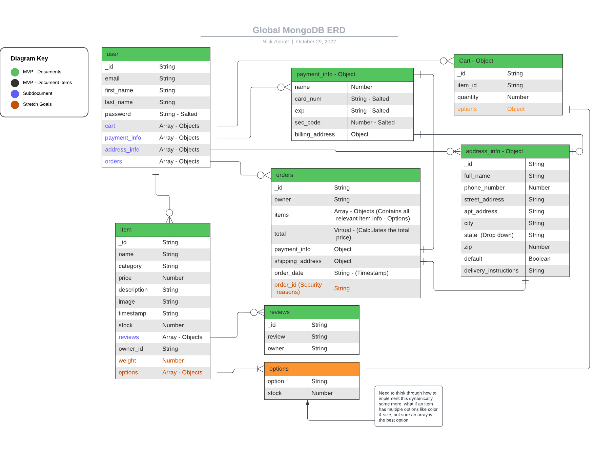

# Global API
This is the global backend API repo

## Technolgies Used
  - [MongoDB](https://www.mongodb.com/)
    - Source-available cross-platform document-oriented database program
    - Classified as a NoSQL database program, MongoDB uses JSON-like documents with optional schemas
  - [Mongoose](https://mongoosejs.com/docs/)
    - JavaScript object-oriented programming library that creates a connection between MongoDB and the Node.js JavaScript runtime environment
  - [Express](https://expressjs.com/)
    - Back end web application framework for building RESTful APIs with Node.js
  - [JSON Web Token](https://github.com/auth0/node-jsonwebtoken)
    - Proposed Internet standard for creating data with optional signature and/or optional encryption whose payload holds JSON that asserts some number of claims
  - [Crypto](https://nodejs.org/api/crypto.html)
    - Crypto module provides cryptographic functionality
  - [Passport](http://www.passportjs.org/docs/)
    - Middleware for Node.js that makes it easy to implement authentication and authorization
  - [Bcrypt](https://www.npmjs.com/package/bcrypt)
    - JavaScript implementation of the bcrypt password hashing function that allows you to easily create a hash out of a password string
  - [Node](https://nodejs.org/en/)
  - [Javascript](https://www.javascript.com/)
  - [Stripe API](https://stripe.com/docs/api)
    - Digital payment processing
  - [Cloudinary API](https://cloudinary.com/documentation/cloudinary_references)
    - Cloud image storage

## Database ERD (Entity Relationship Diagram)
