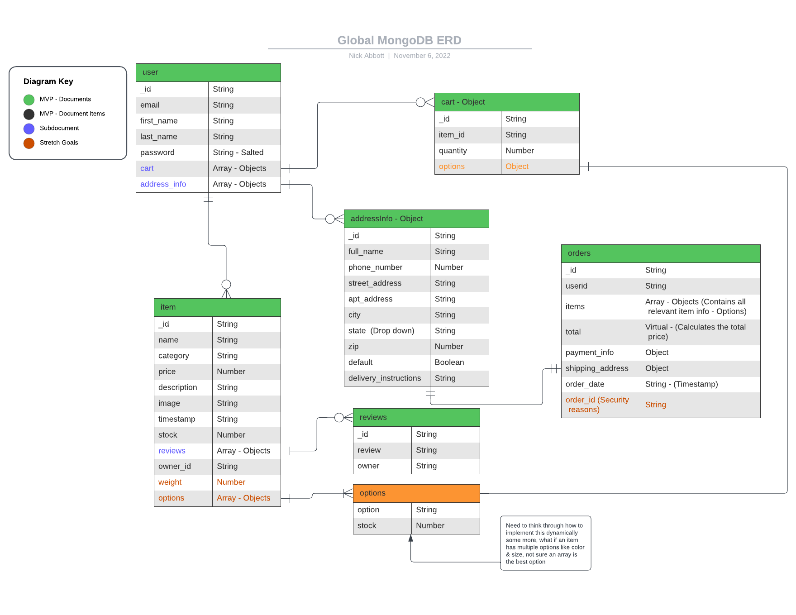

# Global API

## Technolgies Used

  - [MongoDB](https://www.mongodb.com/)
    - Source-available cross-platform document-oriented database program
    - Classified as a NoSQL database program, MongoDB uses JSON-like documents with optional schemas
  - [Mongoose](https://mongoosejs.com/docs/)
    - JavaScript object-oriented programming library that creates a connection between MongoDB and the Node.js JavaScript runtime environment
  - [Express](https://expressjs.com/)
    - Back end web application framework for building RESTful APIs with Node.js
  - [JSON Web Token](https://github.com/auth0/node-jsonwebtoken)
    - Proposed Internet standard for creating data with optional signature and/or optional encryption whose payload holds JSON that asserts some number of claims
  - [Crypto](https://nodejs.org/api/crypto.html)
    - Crypto module provides cryptographic functionality
  - [Passport](http://www.passportjs.org/docs/)
    - Middleware for Node.js that makes it easy to implement authentication and authorization
  - [Bcrypt](https://www.npmjs.com/package/bcrypt)
    - JavaScript implementation of the bcrypt password hashing function that allows you to easily create a hash out of a password string
  - [Node](https://nodejs.org/en/)
  - [Javascript](https://www.javascript.com/)
  - [Stripe API](https://stripe.com/docs/api)
    - Digital payment processing
  - [Cloudinary API](https://cloudinary.com/documentation/cloudinary_references)
    - Cloud image storage

## General Approach
The apporach that we took on this project was to sort out the backend to start and make a really detailed ERD to give the front-end focused engineers a good idea of what to expect from the API. Only having one week to work on a project the size of an eCommerce store meant that we had to set goals for where the API would be at before we started building it. Ultimitly the complexity in integrating swipe and cloudinary put the team on the back foot as what we predicted would take half a day for each took 3+ full days. 

As far as the API, we  decided on a user heavy model where the user's document contianed subdocuments with their cart, and their address info. This is because that is private and individual information that is directly related for the user and would be more efficient to keep in one place. 

## Database ERD (Entity Relationship Diagram)

## API 
### Authentication

| Verb   | URI Pattern            | Controller#Action |
|--------|------------------------|-------------------|
| POST   | `/sign-up`             | `users#signup`    |
| POST   | `/sign-in`             | `users#signin`    |
| PATCH  | `/change-password/` | `users#changepw`  |
| DELETE | `/sign-out/`        | `users#signout`   |

### Address Info

| Verb   | URI Pattern                            | Controller#Action     |
|--------|----------------------------------------|-----------------------|
| GET    | `/addressInfos`                        | `addressInfos#index`  |
| GET    | `/addressInfos/:id`                    | `addressInfos#show`   |
| POST   | `/addressInfos`                        | `addressInfos#create` |
| PATCH  | `/addressInfos/:userId/:addressInfoId` | `addressInfos#update` |
| DELETE | `/addressInfos/:userId/:addressInfoId` | `addressInfos#delete` |

### Cart

| Verb   | URI Pattern     | Controller#Action  |
|--------|-----------------|--------------------|
| GET    | `/cart`         | `cart#index`       |
| GET    | `/cart/:itemId` | `cart#show`        |
| POST   | `/cart`         | `cart#create`      |
| PATCH  | `/cart/:cartId` | `cart#update`      |
| DELETE | `/cart/:cartId` | `cart#delete`      |
| GET    | `/cart/status`  | `cart#checkstatus` |

### Item

| Verb   | URI Pattern   | Controller#Action |
|--------|---------------|-------------------|
| GET    | `/items`      | `items#index`     |
| GET    | `/items/mine` | `items#userIndex` |
| GET    | `/items/:id`  | `items#show`      |
| POST   | `/items`      | `items#create`    |
| PATCH  | `/items/:id`  | `item#update`     |
| DELETE | `/items/:id`  | `items#delete`    |

### Order

| Verb | URI Pattern    | Controller#Action  |
|------|----------------|--------------------|
| GET  | `/orders`      | `orders#index`     |
| GET  | `/orders/mine` | `orders#userIndex` |
| GET  | `/orders/:id`  | `orders#show`      |
| POST | `/orders`      | `orders#create`    |

## Major Hurdles & Unsolved Problems
  - Major Hurdles 
    - Stripe Integration
      - Stripe became very tricky to implement and took a major chunk of evans week
    - Payment Info Storage
      - We originally had planned to store the users payment info, but were then instructed to integrate stripe in a way to do that due to payment info being federally protected
  - Unsolved Problems
    - Cloudinary API Integration
      - We were unable to figue out how to implement cloudinary image upload
    - Order document generation
      - Due to the confusion in implementing stripe, this was to be done after implememntaion due to certain built in stripe features, however due to time constraints we could not get this to work
    - Cart
      - Checking if items are still in stock in quantities specified & clearing cart after orders
        - These were to be done when we finalized stripe integration, due to time constraints this could not be completed